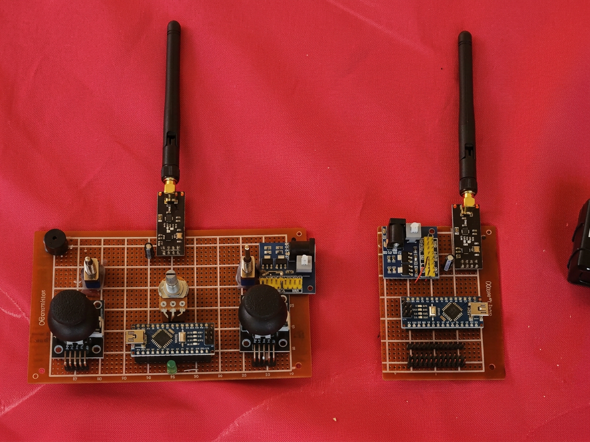
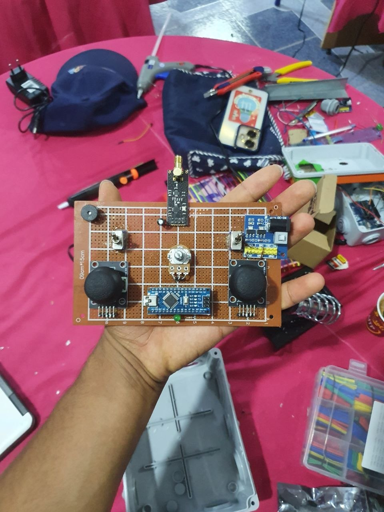
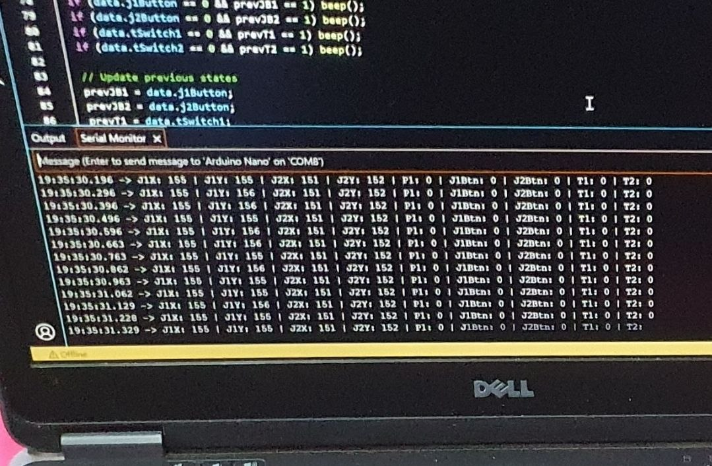
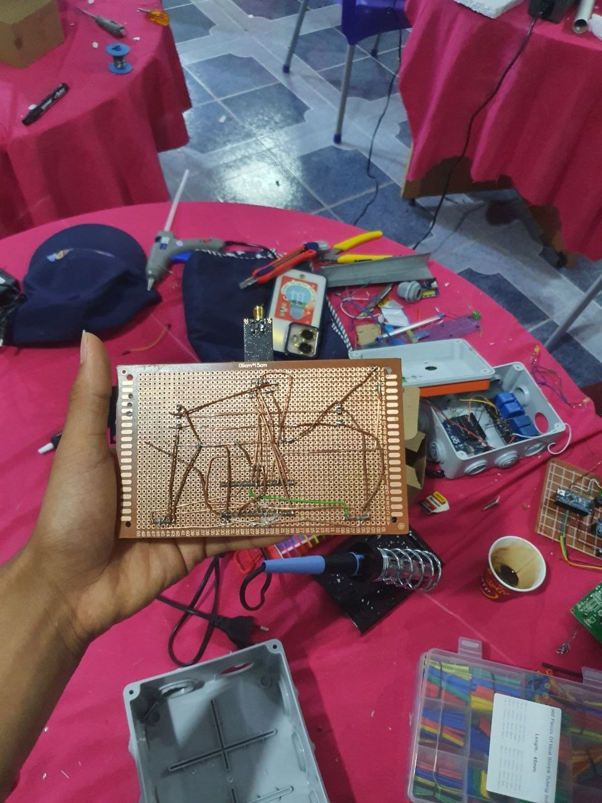
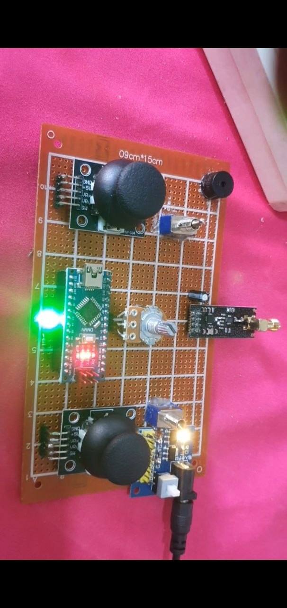

# 📻 Custom nRF24L01+ RC Transceiver System 

**A high-performance, custom-engineered wireless remote control system featuring 5 proportional PWM channels and 4 digital channels. Built with Arduino Nanos and nRF24L01+ PA/LNA modules for long-range robotics and RC vehicles.**


*(Custom Transmitter and Receiver layouts featuring dual analog joysticks, toggle switches, a single center potentiometer, and haptic buzzer feedback).*

---

## 📂 Repository Structure

```text
nRF24-Custom-Transceiver/
│
├── 💻 Firmware/
│   ├── Transmitter_TX/
│   │   └── Transmitter_TX.cpp    # Reads inputs, packs struct, sends via RF
│   └── Receiver_RX/
│       └── Receiver_RX.cpp       # Receives struct, drives Hardware/Software 
│
├── 💻 hardware/
│   └──  SCHEMATIC

├── 🖼️ Assets/                    # Images of the hardware build
│
└── 📄 README.md                  # This documentation file
```
## 📋 System Overview & Key Features

This project replaces commercial RC controllers with a custom 2.4GHz ISM band solution. It is optimized for low latency, fail-safe reliability, and hardware flexibility.

* **High Range:** Utilizes the nRF24L01+ with PA (Power Amplifier) and LNA (Low Noise Amplifier) for extreme range.
* **5 Proportional Channels:** 4 hardware-driven PWM channels (joysticks) + 1 Software PWM channel (potentiometer).
* **4 Digital Channels:** 2 joystick push-buttons + 2 top-mounted toggle switches.
* **Haptic Feedback:** The transmitter features edge-detection logic to trigger a buzzer beep whenever a switch or button changes state.
* **Auto-Failsafe:** The receiver tracks telemetry timestamps. If connection is lost for >1000ms, all outputs instantly reset to safe/neutral positions.

---

## 🛒 Bill of Materials (Hardware)


### Transmitter (TX) Board
* 1x Arduino Nano
* 1x nRF24L01+ PA/LNA Module (with Antenna)
* 2x Analog Joysticks (with integrated push buttons)
* 1x 10kΩ Rotary Potentiometer
* 2x SPDT Toggle Switches
* 1x 5V Active Buzzer
* 1x Power Supply Module

### Receiver (RX) Board
* 1x Arduino Nano
* 1x nRF24L01+ PA/LNA Module (with Antenna)
* Custom headers for servos, ESCs, or motor drivers

---

## 📡 Data Packet & Payload Optimization

To achieve real-time responsiveness, the payload is packed into a highly optimized **9-byte C-struct**. This prevents radio bottlenecking and ensures lightning-fast transmission times.
```Cpp
// 9-Byte Data Payload
struct Data_Package {
  byte j1PotX;     // Left Joystick X (0-255)
  byte j1PotY;     // Left Joystick Y (0-255)
  byte j1Button;   // Left Joy Button (0/1)
  byte j2PotX;     // Right Joystick X (0-255)
  byte j2PotY;     // Right Joystick Y (0-255)
  byte j2Button;   // Right Joy Button (0/1)
  byte pot1;       // Center Potentiometer (0-255)
  byte tSwitch1;   // Left Toggle (0/1)
  byte tSwitch2;   // Right Toggle (0/1)
};
```

## 🔌 Hardware Pin Mapping

### Transmitter (TX) Mapping

| Component | Arduino Pin | Type |
| :--- | :--- | :--- |
| **Left Joystick (X, Y, Btn)** | `A1`, `A0`, `D2` | Analog IN / Digital IN |
| **Right Joystick (X, Y, Btn)** | `A2`, `A3`, `D3` | Analog IN / Digital IN |
| **Potentiometer** | `A4` | Analog IN |
| **Toggles (T1, T2)** | `D4`, `D5` | Digital IN (Pullup) |
| **Buzzer** | `D9` | Digital OUT |
| **nRF24L01 (CE, CSN)** | `D7`, `D8` | SPI Control |

### Receiver (RX) Mapping

| Signal Received | RX Output Pin | Signal Type |
| :--- | :--- | :--- |
| **Left Joystick X** | `D3` | Hardware PWM |
| **Left Joystick Y** | `D5` | Hardware PWM |
| **Right Joystick X** | `D6` | Hardware PWM |
| **Right Joystick Y** | `D9` | Hardware PWM |
| **Potentiometer** | `A3` | Software PWM |
| **Left Joy Button** | `D4` | Digital OUT |
| **Right Joy Button** | `D7` | Digital OUT |
| **Left Toggle (T1)** | `D8` | Digital OUT |
| **Right Toggle (T2)** | `A4` | Digital OUT |

---

## 💻 Firmware Engineering Highlights

### 1. Software PWM Integration (`SoftPWM.h`)
The Arduino Nano only has 6 hardware PWM pins, some of which conflict with the SPI bus needed by the nRF24 module. To support a 5th proportional channel (the potentiometer) on pin `A3`, the receiver utilizes a Timer-based Software PWM library. This allows smooth analog-style outputs without blocking the main CPU loop.

### 2. Auto-Failsafe Mechanism
Runaway vehicles are a major risk in custom RC builds. The receiver tracks `lastReceiveTime` using the `millis()` hardware timer. If a packet is missed for more than 1 second, the system triggers `resetData()`, forcing all joysticks to center (`127`) and disabling all digital switches.
```cpp
  if (radio.available()) {
    radio.read(&data, sizeof(Data_Package));
    lastReceiveTime = millis();
  }

  // Failsafe trigger
  if (millis() - lastReceiveTime > 1000) {
    resetData(); // Return all axes to 127 (neutral)
  }
```
### 3. State-Change Edge Detection (Haptic Feedback)



Instead of continuous buzzing while a button is held, the transmitter uses state-tracking (`prevJB1`, `prevT1`, etc.) to detect **falling edges**. This ensures the buzzer only emits a crisp, 100ms verification beep exactly when a switch is flipped.

### 4. RF Optimization for Max Range

* `radio.setAutoAck(false)`: Disables auto-acknowledgment. In RC control, dropping a single packet is fine because the next one arrives milliseconds later. This cuts transmission overhead in half.
* `radio.setDataRate(RF24_250KBPS)`: Forces the lowest data rate to maximize receiver sensitivity and physical range.

---

## 🚀 Getting Started

1. **Libraries Required:** Install the `RF24` library by TMRh20 and the `SoftPWM` library via the Arduino IDE Library Manager.
2. **Power Stability (Crucial):** nRF24L01 PA+LNA modules draw significant current bursts during transmission. You **must** solder a `10µF` to `100µF` capacitor directly across the VCC and GND pins of both radio modules to prevent resetting.
3. **Upload:** Flash the `Transmitter_TX.ino` to the controller and `Receiver_RX.ino` to the vehicle board.
4. **Test:** Open the Serial Monitor on the Receiver (`9600` baud) to verify the decoded 9-byte structs are updating in real-time.
Let's Connect
If you found this project helpful or want to discuss embedded systems and RF communication, feel free to reach out!
